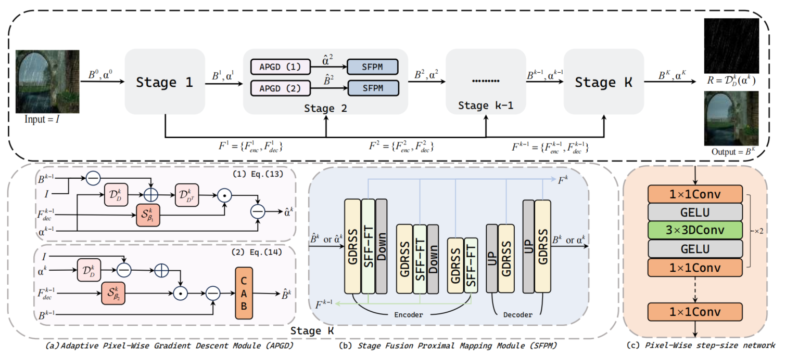

# Pixel Adaptive Deep Unfolding Network with State Space Model for Image Derainin 

Yao Xiao, and Youshen Xia

## ⚠️ Code Availability Notice
🚧 **The full network architecture code will be released once the paper is accepted.**  
Currently, only the pre-trained model weights and visual results are publicly available for demonstration purposes. Please stay tuned for updates!


<!-- [Paper Download](https://openaccess.thecvf.com/content/CVPR2023/html/Chen_Learning_a_Sparse_Transformer_Network_for_Effective_Image_Deraining_CVPR_2023_paper.html) -->

<!-- <hr />

> **Abstract:** *Transformers*
<hr /> -->

<!-- ## Network Architecture

 -->

## Datasets
<table>
<thead>
  <tr>
    <th>Dataset</th>
    <th>Rain200L</th>
    <th>Rain200H</th>
    <th>DID-Data</th>
    <th>DDN-Data</th>
    <th>SPA-Data</th>
  </tr>
</thead>
<tbody>
  <tr>
    <td>Baidu Cloud</td>
    <td> <a href="https://pan.baidu.com/s/1RV677SOIBgWB_3u9rInX4w">Download (nkyp)</a> </td>
    <td> <a href="https://pan.baidu.com/s/1AjR_gGMwadnaZRU-U_FJhQ">Download (ajck)</a> </td>
    <td> <a href="https://pan.baidu.com/s/1sUhI5xz9XGu0gTnNcYQ3xw">Download (hgg6)</a> </td>
    <td> <a href="https://pan.baidu.com/s/11cZKW0eGBunzgYatT82SPA">Download (62iw)</a> </td>
    <td> <a href="https://pan.baidu.com/s/18RxAjfJABRZJ8XculdaXoA">Download (vz83)</a> </td>
  </tr>
</tbody>
</table>

## Training
1. Please download the corresponding training datasets and put them in the folder `Datasets/train`. Download the testing datasets and put them in the folder `Datasets/test`. 
2. Follow the instructions below to begin training our model.
```
cd PADmamba
bash train.sh
```
Run the script then you can find the generated experimental logs in the folder `experiments`.

## Testing
1. Please download the corresponding testing datasets and put them in the folder `test/input`. Download the corresponding pre-trained models and put them in the folder `pretrained_models`.
2. Please modify the corresponding paths in the file `test.py` to the corresponding parsers `input_dir` and `result_dir`.
3. Follow the instructions below to begin testing our model.
```
python test.py'
```
Run the script then you can find the output visual results in the folder `test/output/Deraining`.

## Pre-trained Models
<table>
<thead>
  <tr>
    <th>Dataset</th>
    <th>Rain200L</th>
    <th>Rain200H</th>
    <th>DID-Data</th>
    <th>DDN-Data</th>
    <th>SPA-Data</th>
  </tr>
</thead>
<tbody>
  <tr>
    <td>Baidu Cloud</td>
    <td> <a href="https://pan.baidu.com/s/1csOhCV8BxahzANnR9JMUPw">Download (1p8d)</a>  </td>
    <td> <a href="https://pan.baidu.com/s/1GdC_n_SJ1xutkG1hido9Ng">Download (xggm)</a>  </td>
    <td> <a href="https://pan.baidu.com/s/1JUotJ1SrpfOELF41_3VoKg">Download (qf2k)</a>  </td>
    <td> <a href="https://pan.baidu.com/s/1mZg87fyCxZq_gFTNKqUcmg">Download (fewt)</a>  </td>
    <td> <a href="https://pan.baidu.com/s/1oy9Aa_LDTbGlfz27iYlNzA">Download (85u4)</a>  </td>
  </tr>
</tbody>

</table>

## Visual Deraining Results
<table>
<thead>
  <tr>
    <th>Dataset</th>
    <th>Rain200L</th>
    <th>Rain200H</th>
    <th>DID-Data</th>
    <th>DDN-Data</th>
    <th>SPA-Data</th>
  </tr>
</thead>
<tbody>
  <tr>
    <td>Baidu NetDisk	</td>
    <td> <a href="https://pan.baidu.com/s/1oIU-Bmm261G8EBkdRbZeAA">DWL (qmj8)</a>  </td>
    <td> <a href="https://pan.baidu.com/s/1mzN_HMX18bf7WB0FFR1IXg">DWL (2byh)</a>  </td>
    <td> <a href="https://pan.baidu.com/s/1QBCKTAW0Add1oM1vLuFgog">DWL (9prg)</a>  </td>
    <td> <a href="https://pan.baidu.com/s/1f0npqDmWSzM3DvoSkiFS2Q">DWL (u6ii)</a>  </td>
    <td> <a href="https://pan.baidu.com/s/1n8bXvys9gpQkCO5xByoiXA">DWL (fwt7)</a>  </td>
  </tr>
</tbody>
</table>


## Performance Evaluation
See folder "evaluations/Evaluation_DID-Data_DDN-Data or Evalution_Rain200L_Rain200H_SPA-Data". 


Some of the experimental results are based on the results collected by [DRSformer](https://github.com/cschenxiang/DRSformer), which is very comprehensive. Thanks for their awesome work.


## Citation
If you are interested in this work, please consider citing:

    @InProceedings{-,
        author={-}, 
        title={-},
        booktitle={-},
        month={-},
        year={-},
        pages={-}
    }

## Acknowledgment
This code is based on the [Vim](https://github.com/hustvl/Vim)、[DRSformer](https://github.com/cschenxiang/DRSformer). Thanks for their awesome work.

## Contact
If your submitted issue has not been noticed or there are further questions, please contact yxiao1998@outlook.com.

